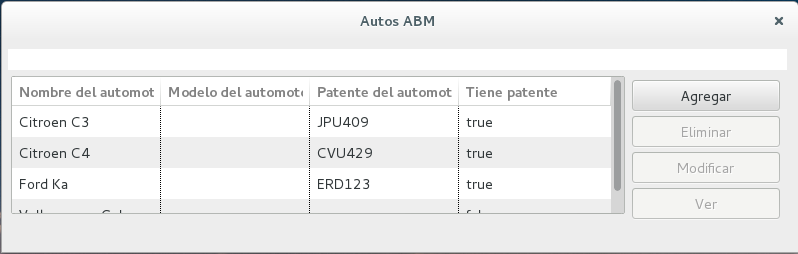
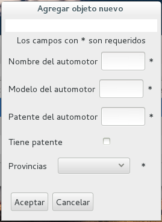
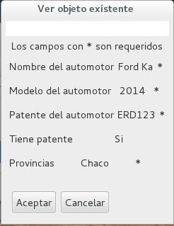
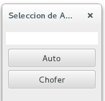

Arena ABM Builder
===============

Framework for creating an ABM with Arena-UI framework

Requerimientos:
---------------

- JRE 1.8 o superior
- Maven 3
- Arena Framework

Contenido del framework:
------------------------

- **TestImplementacion/Auto**: Clase de ejemplo para demostracion del framework.
- **TestImplementacion/Chofer**: Clase de ejemplo para demostracion del framework.
- **TestImplementacion/TestSimpleApplication**: Applicacion que usa el ABM para la clase Auto.
- **TestImplementacion/TestApplication**: Aplicacion que usa la multiABM con la clase Auto y Chofer.


- **annotations.abm/Title**: annotation para la clase con la cual queremos trabajar en el ABM. Sus parametros son:
	- **title**: titulo del ABM, su valor default es "ABM" 
	- **addMethod**: Nombre del metodo que la clase contiene para cuando se agrega un elemento en el ABM, su valor default es "";
	- **editMethod**: Nombre del metodo que la clase contiene para cuando se modifica un elemento en el ABM, su valor default es "";
	- **removeMethod**: Nombre del metodo que la clase contiene para cuando se elimina un elemento en el ABM, su valor default es "";
	- **getInitialMethod**: Nombre del metodo que la clase contiene para cuando se abre el ABM y se cargan los datos iniciales, su valor default es "";

- **annotations.abm/Validator**: Esta clase nos da los validadores predefinidos y usuales. Estos validadores son:
	- **validateUserName**: Valida que el dato ingresado sea con numeros, letras, _ o - y que no supere los 15 caracteres.
	- **validateNotNumbersUnlimited**: Valida que el dato ingresado sea solo con letras y sin limite
	- **validateNotNumbersLimited**: Valida que el dato ingresado sea solo con letras y que no supere los 30 caracteres.
	- **validateNumbers**: Valida que el dato ingresado sea solo con numeros y sin limite.

- **annotations.visualWidgets/FieldCheck**: annotations de atributo para atributos Boolean, sus parametros pueden ser:
	- **name**: Nombre para mostrar e indicar que es este atributo, su valor default es ""
	- **modifiable**: Indica si se puede modificar, su valor default es True

- **annotations.visualWidgets/FieldText**: annotations de atributo para atributos String
	- **name**: Nombre para mostrar e indicar que es este atributo, su valor default es ""
	- **modifiable**: Indica si se puede modificar, su valor default es True
	- **required**: Indica si el atributo es requerido si o si, su valor default es False
	- **validator**: Nombre del validador dentro de la clase para este atributo , su valor default es ""
	- **fwValidator**: Nombre del validador predefinido por el framework, su valor default es ""

- **annotations.visualWidgets/FieldSelect**: annotations de atributo para atributos String y con opciones listadas 
	- **name**: Nombre para mostrar e indicar que es este atributo, su valor default es ""
	- **modifiable**: Indica si se puede modificar, su valor default es True
	- **required**: Indica si el atributo es requerido si o si, su valor default es False
	- **choices**: Nombre del atributo donde esta la lista de datos posibles para ese atributo.

- **implementation.ui/MainWindow**: Clase que nos permite crear una ABM para una clase
- **implementation.ui/MultiMainWindow**: Clase que nos permite crear una ABM de multiples clases.


Manual de Usuario y ejemplos de uso:
------------------------------------

Antes de comenzar, hay que saber para que se utiliza este framework y que facilidades nos da.
Este framework es para la creación automatica de una interfaz de usuario con funcionalidad de ABM para cualquier tipo de Entidad.

Ejemplo de uso para una Clase:
------------------------------

En este caso procederemos a crear un ABM de una clase Auto.

Para este ejemplo partimos de una clase con el siguiente codigo:

```java
public class Auto {
	
	public String nombre;
	public String modelo;
	public String patente;
	public boolean tienePatente;
	public String provincia;
	
}
```

Para poder crear una ABM de esta clase, el framework provee una clase llamada FWObject de la cual la clase Auto tiene que heredar.
Entonces la clase Auto queda con el siguiento codigo:

```java
public class Auto extends FWObject {
	
	public String nombre;
	public String modelo;
	public String patente;
	public boolean tienePatente;
	public String provincia;
	
}
```

Para que Auto sea una clase que el ABM pueda comprender hay que agragar el annotation Title.
En este caso vamos a agregar que el ABM tenga el titulo "Autos ABM"

```java
@Title(title = "Autos ABM")
public class Auto extends FWObject {
	
	public String nombre;
	public String modelo;
	public String patente;
	public boolean tienePatente;
	public String provincia;
	
}
```

Una vez creado esto podemos empezar a agregar annotation para los atributos.
En este caso vamos a agregar los siguiente annotation:

- **FieldText** para los atributos de tipo String
- **FieldCheck** para los atributos de tipo Boolean
- **FieldSelector** para los atributos de tipo String que tengan opciones definidas

Con lo que el codigo de Auto queda de la siguiente forma:

```java
@Title(title = "Autos ABM")
public class Auto extends FWObject {
	
	@FieldText(name = "Nombre del automotor")
	public String nombre;
	
	@FieldText(name = "Modelo del automotor")
	public String modelo;
	
	@FieldText(name = "Patente del automotor")
	public String patente;
	
	@FieldCheck(name = "Tiene patente")
	public boolean tienePatente;
	
	@FieldSelector(choices = "provincias", name = "Provincias")
	public String provincia;
	
	String[] provincias = { "Buenos Aires", "Cordoba", "La Rioja", "Chaco", "Catamarca" };
	
}
```

Como puede verse en el ejemplo del codigo con las annotations para atributos, cada atributo tiene en la annotation un **name** que es el texto con el cual se pide el dato dentro del ABM.
Ademas en el caso del FieldSelector se agrega un parametro **choices** con el cual indicamos el nombre de la varible de clase donde se encuentran las opciones y mas abajo declaramos la variable que es una lista de Strings con las opciones pocibles para ese atributo.
   
Ahora vamos a agregarle el dato de si algun atributo no es modificable, para eso existe en cualquier annotation de atributo el parametro **modifiable** que por default es True.
Vamos a definir que el atributo provincia no es modificable:

```java
@Title(title = "Autos ABM")
public class Auto extends FWObject {
	
	@FieldText(name = "Nombre del automotor")
	public String nombre;
	
	@FieldText(name = "Modelo del automotor")
	public String modelo;
	
	@FieldText(name = "Patente del automotor")
	public String patente;
	
	@FieldCheck(name = "Tiene patente")
	public boolean tienePatente;
	
	@FieldSelector(choices = "provincias", modifiable = false, name = "Provincias")
	public String provincia;
	
	String[] provincias = { "Buenos Aires", "Cordoba", "La Rioja", "Chaco", "Catamarca" };
	
}
```

Ahora vamos a agregarle el dato de si algun atributo es si o si requerido, para eso existe en cualquier annotation de atributo el parametro **required** que por default es False.
Vamos a definir que el atributo patente es requerido:


```java
@Title(title = "Autos ABM")
public class Auto extends FWObject {
	
	@FieldText(name = "Nombre del automotor")
	public String nombre;
	
	@FieldText(name = "Modelo del automotor")
	public String modelo;
	
	@FieldText(name = "Patente del automotor", required=true)
	public String patente;
	
	@FieldCheck(name = "Tiene patente")
	public boolean tienePatente;
	
	@FieldSelector(choices = "provincias", modifiable = false, name = "Provincias")
	public String provincia;
	
	String[] provincias = { "Buenos Aires", "Cordoba", "La Rioja", "Chaco", "Catamarca" };
	
}
```

Para agregar mas opciones y hacer que el ABM sea mucho mejor, existen los validadores que se ejecutan en tiempo real miestras los usuarios ingresan datos.
Para validar el framework ofrece dos posibles parametros en todos los annotations:
- **fwValidator**: Validadores predefinidos por el framework
- **validator**: Nombre del metodo validador que la clase tenga

Para mostrar el uso vamos a agregar un validador en la clase **validarPatente** y un fwValidator llamado **validateNumbers** que valida que el dato ingresado sea numerico.

```java
@Title(title = "Autos ABM")
public class Auto extends FWObject {
	
	@FieldText(name = "Nombre del automotor")
	public String nombre;
	
	@FieldText(name = "Modelo del automotor", fwValidator="validateNumbers")
	public String modelo;
	
	@FieldText(name = "Patente del automotor", required=true, validator="validarPatente")
	public String patente;
	
	@FieldCheck(name = "Tiene patente")
	public boolean tienePatente;
	
	@FieldSelector(choices = "provincias", modifiable = false, name = "Provincias")
	public String provincia;
	
	String[] provincias = { "Buenos Aires", "Cordoba", "La Rioja", "Chaco", "Catamarca" };
		
	public boolean validarPatente(String patente){
		String PATENTE_PATTERN = "^[a-zA-Z]{0,3}[0-9]{0,3}$";
		return Pattern.compile(PATENTE_PATTERN).matcher(patente).matches();
	}

}
```

Con esto tenemos toda una Clase adaptada para el ABM. 
Algo mas que podemos agregarle son metodos para persistencia propia de los datos.
Para lograr esto el framework ofrece los siguientes parametros en el annotation **Title**:

- **addMethod**: Metodo para agregar un objeto Auto
- **editMethod**: Metodo para modificar un objeto Auto
- **removeMethod**: Metodo para eliminar un objeto Auto
- **getInitialMethod**: Metodo para obtener los datos iniciales

En este caso vamos a agregar un metodo que nos da los datos iniciales

```java
@Title(title = "Autos ABM", getInitialMethod="getAutos")
public class Auto extends FWObject { 

	@FieldText(name = "Nombre del automotor")
	public String nombre;
	
	@FieldText(name = "Modelo del automotor", fwValidator="validateNumbers")
	public String modelo;
	
	@FieldText(name = "Patente del automotor", required=true, validator="validarPatente")
	public String patente;
	
	@FieldCheck(name = "Tiene patente")
	public boolean tienePatente;
	
	@FieldSelector(choices = "provincias", modifiable = false, name = "Provincias")
	public String provincia;
	
	String[] provincias = { "Buenos Aires", "Cordoba", "La Rioja", "Chaco", "Catamarca" };
		
	public boolean validarPatente(String patente){
		String PATENTE_PATTERN = "^[a-zA-Z]{0,3}[0-9]{0,3}$";
		return Pattern.compile(PATENTE_PATTERN).matcher(patente).matches();
	}

	public List<Auto> getAutos(){
		ArrayList<Auto> autos = new ArrayList<Auto>();
		autos.add(new Auto("Citroen C3", "JPU409", "Buenos Aires", true));
		autos.add(new Auto("Citroen C4", "CVU429", "Catamarca", true));
		autos.add(new Auto("Ford Ka", "ERD123", "Chaco", true));
		autos.add(new Auto("Volkswagen Gol", "", "La Rioja", false));
		return autos; 
	}

}
```

Con todo esto ya tenemos una clase Auto totalmente configurada para poder hacer el ABM.
Para generar el ABM vamos a crear un main dentro de una clase de Test para mostrar el como generar un ABM:
  
```java

import implementation.applicationModel.ABMApplicationModel;
import implementation.ui.MainWindow;
import org.uqbar.arena.Application;
import org.uqbar.arena.windows.Window;

public class TestApplication extends Application {
	
	@Override
	protected Window<?> createMainWindow() {
		return new MainWindow(this, new ABMApplicationModel(Auto.class));
	}

	public static void main(String[] args) {
		new TestApplication().start();
	}

}
```

Con todo eso ya tenemos un ejemplo de un ABM.
La ventana quedaria asi apenas se abre:




Ventana para agregar:



Ventana para ver:



Ventana para modificar:


Ejemplo de uso para Multiples Clase:
------------------------------

Este framework agrega la opcion de usar multiples Clases y seleccionar cual ABM ir abrirndo para trabajar.
Para esto agregamos la clase Chofer, ya adapatadar para el framework.
El codigo de Chofer es:

```java
@Title(title = "Chofer ABM", addMethod="add", editMethod="edit", removeMethod="remove")
public class Chofer extends FWObject {

	@FieldText(name = "Nombre del chofer", validator="validateName")
	private String nombre;

	@FieldText(name = "Domicilio del chofer", required=true)
	private String domicilio;
	
	@FieldCheck(modifiable = false, name = "Tiene auto")
	private boolean tieneAuto;

	@FieldSelector(choices = "provincias", modifiable = false, name = "Provincias")
	public String provincia;

	String[] provincias = { "Buenos Aires", "Cordoba", "La Rioja", "Chaco", "Catamarca" };

	public boolean validateName(String name){
		String NAME_PATTERN = "^[a-zA-Z]{0,20}$";
		return Pattern.compile(NAME_PATTERN).matcher(name).matches();
	}

	@Override
	public String toString() {
		String texto = this.nombre + ", con domicilio en " + this.domicilio + " (provincia: " + this.provincia + ") y ";
		if (this.tieneAuto) return texto + "tiene auto";
		else return texto + " no tiene auto";
	}

	public void add(Chofer chofer){
		this.loggeo("Se agrego -> " + chofer.toString());
	}

	public void edit(Chofer chofer){
		this.loggeo("Se modifico -> " + chofer.toString());
	}
	
	public void remove(Chofer chofer){
		this.loggeo("Se elimino -> " + chofer.toString());
	}

	public void loggeo(String texto){
		 Logger logger = Logger.getLogger("ChoferLog");  
		 FileHandler fh;
		try {
			fh = new FileHandler("/tmp/choferes.log");
			logger.addHandler(fh);
			SimpleFormatter formatter = new SimpleFormatter();
			fh.setFormatter(formatter);
			logger.info(texto);
		} catch (SecurityException | IOException e) {
			e.printStackTrace();
		}
	}
}
```

Con esta clase ya podemos crear en una clase de test una ejemplo de manejo de multiples clases
El codigo para la aplicacion seria:

```java
import java.util.ArrayList;

import implementation.FWObject;
import implementation.applicationModel.MultiABMApplicationModel;
import implementation.ui.MultiMainWindow;

import org.uqbar.arena.Application;
import org.uqbar.arena.windows.Window;

public class TestApplication extends Application {
	
	@Override
	protected Window<?> createMainWindow() {
		ArrayList<Class<? extends FWObject>> list = new ArrayList<Class<? extends FWObject>>();
		list.add(Auto.class);
		list.add(Chofer.class);
		return new MultiMainWindow(this, new MultiABMApplicationModel(list));
	}

	public static void main(String[] args) {
		new TestApplication().start();
	}
}
```

Con esto ya tenemos una ventana que nos permite elegir la clase para trabajar en ABM:
 


En esa pantalla solo tocamos los botones y se abre el ABM de esa Clase y despues se puede retornar para abrir otra ABM.


Desarrolladores:
----------------

- **Federico Gonzalez**
- **Erwin Debusschere**
- **Sergio Rivas**
- **Alexis Chan**
